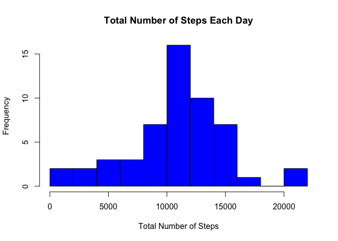
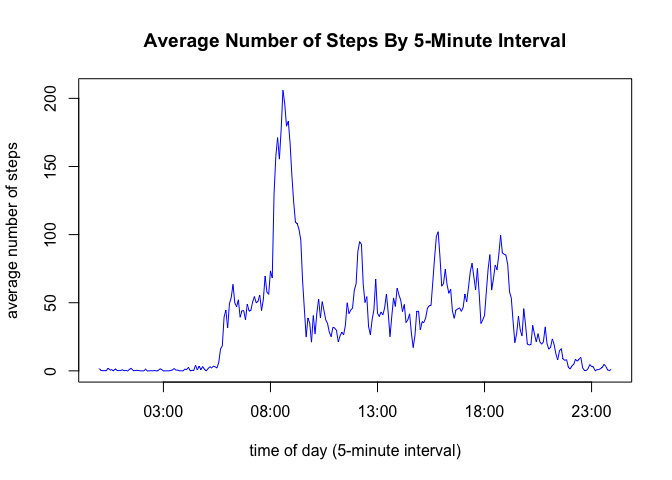
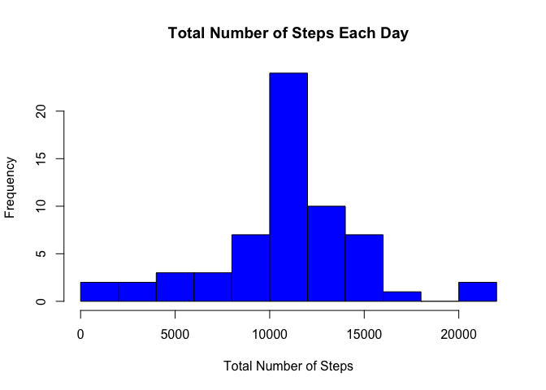
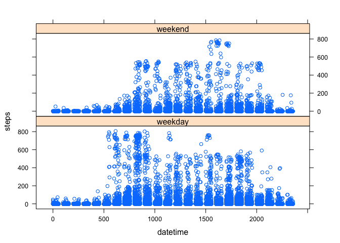

# Reproducible Research: Peer Assessment 1


## Loading and preprocessing the data

The object of the following analysis, is personal activity data collected from an
anonymous individual between October and November of 2012. Each sample represents
the number of steps taken in 5-minute interval on a given date. 

The activity data is loaded into R as follows:


```r
# construct the path
workDirectory<-"/Users/dgn2/Documents/RStudio/work/Reproducible Research"
folder<-"data"
fileName="activity.csv"
fileNameAndPath<-file.path(workDirectory,folder,fileName)
# read raw data into data frame
DT=read.csv(fileNameAndPath,header=TRUE,na.strings="NA")
# add the datetime (i.e., merge date and time)
DT <- transform(DT,dateTime=as.POSIXlt(strptime(paste(date,sprintf("%04d", 
    DT$interval)),"%Y-%m-%d %H%M")))
# convert the date
DT <- transform(DT, date = as.Date(date))
```

To facilitate seasonal analysis, the data is re-arranged into a matrix where
the rows contain data for each distinct 5-minute interval and the columns 
contain data for each distinct date. This is done in R as follows:


```r
# find the number of distinct 5-minute intervals [288 = (60/5)*24]
numberOfMinutesInDay<-nrow(matrix(unique(DT$interval)))
# re-arrage the data into a matrix (distinct 5-minute interval X date)
data_intervalByDate<-matrix(DT$steps,numberOfMinutesInDay)
```

## What is mean total number of steps taken per day?

Ignoring the missing values in the data, we can create a histogram of the total
number of steps taken each day in R as follows:


```r
meanStepsByDate<-colMeans(data_intervalByDate,na.rm=FALSE)
numberOfStepsByDate<-colSums(data_intervalByDate,na.rm=FALSE)
# remove the NAs
numberOfStepsByDateNoNAs<-numberOfStepsByDate[!is.na(numberOfStepsByDate)]

# create the histogram
hist(numberOfStepsByDateNoNAs,breaks=15,col="blue",xlab="Total Number of Steps",
     ylab="Frequency",main="Total Number of Steps Each Day")
```

 

The mean and median total number of steps taken per day are given by the 
following R code:


```r
# compute the mean and median
meanNumberOfSteps<-mean(numberOfStepsByDateNoNAs)
medianNumberOfSteps<-median(numberOfStepsByDateNoNAs)

meanNumberOfSteps
```

```
## [1] 10766.19
```

```r
medianNumberOfSteps
```

```
## [1] 10765
```

The mean is 1.0766189\times 10^{4} and the median is 1.0765\times 10^{4}.

## What is the average daily activity pattern?

We find the number steps for each 5-minute interval (i.e., averaged across all
days at each distinct interval) with the following R code:


```r
# find the average number of steps for each 5-minute interval (i.e., averaged 
# across all days at each distinct interval)
meanStepsByInterval<-rowMeans(data_intervalByDate,na.rm=TRUE)
# find the total number of steps for each 5-minute interval (i.e., summed 
# across all days at each distinct interval)
numberOfStepsByInterval<-rowSums(data_intervalByDate,na.rm=TRUE)

# find the distinct 5-minute intervals and format
distinctIntervals<-unique(sprintf("%04d", DT$interval))
```

We then plot the time series of the mean number of steps by 5-minute interval as: 


```r
# make a time series plot of the 5-minute 
plot(unique(strptime(sprintf("%04d", DT$interval),"%H%M")),meanStepsByInterval,
    type='l',col="blue",xlab="time of day (5-minute interval)",
    ylab="average number of steps",
    main="Average Number of Steps By 5-Minute Interval")
```

 

We then determine which 5-minute interval - on average across all the days in the
dataset - contains the maximum number of steps in R as follows:


```r
# find the 5-minute interval with the highest mean number of steps
maxInterval<-distinctIntervals[which.max(meanStepsByInterval)]
maxStepsByInterval<-round(meanStepsByInterval[which.max(meanStepsByInterval)])

maxInterval
```

```
## [1] "0835"
```

```r
maxStepsByInterval
```

```
## [1] 206
```

The interval 0835 is has the highest mean number of steps, 206

## Imputing missing values
Missing values introduce bias into some calculations or summaries of the data.

The number of missing values is determined in R as follows:


```r
# (1) Total number of missing values in the dataset
numberOfNAs<-sum(is.na(DT$steps))

numberOfNAs
```

```
## [1] 2304
```

We compute the mean over all days by distinct 5-minute interval and use these 
values to fill missing values as follows:


```r
# (2) fill in all missing values in the dataset
# find the missing days
NAsByDate<-colSums(is.na(data_intervalByDate))
# copy the matrix
data_intervalByDateNAsFilled<-data_intervalByDate
# fill missing days with the average number of steps by interval
data_intervalByDateNAsFilled[,NAsByDate!=0]<-meanStepsByInterval
```

We store the new dataset in a new data frame as follows:


```r
# make a copy of the original data frame
DT_NAsFilled<-DT
# flatten the matrix where we filled NAs and create a new dataset (data frame)
DT_NAsFilled$steps=matrix(data_intervalByDateNAsFilled)
```

We can now examine the histogram of the total number of steps again, this time
using the data where NAs have been filled using the simple strategy described
above. The R code looks like this:


```r
# (4) make a histogram of the total number of steps taken each day
numberOfStepsByDate_NAsFilled<-colSums(data_intervalByDateNAsFilled,na.rm=FALSE)

# create the histogram
hist(numberOfStepsByDate_NAsFilled,breaks=15,col="blue",xlab="Total Number of Steps",
     ylab="Frequency",main="Total Number of Steps Each Day")
```

 

We can also compute the mean and median and compare them with the original values
where we ignored NAs computed above:


```r
# -mean and median total number of steps taken per day
meanNumberOfSteps_NAsFilled<-mean(numberOfStepsByDate_NAsFilled)
medianNumberOfSteps_NAsFilled<-median(numberOfStepsByDate_NAsFilled)

meanNumberOfSteps_NAsFilled
```

```
## [1] 10766.19
```

```r
medianNumberOfSteps_NAsFilled
```

```
## [1] 10766.19
```

Compare these with our original values:


```r
meanNumberOfSteps
```

```
## [1] 10766.19
```

```r
medianNumberOfSteps
```

```
## [1] 10765
```

While the mean does not change, the median does.

## Are there differences in activity patterns between weekdays and weekends?


```r
meanStepsByInterval_NAsFilled<-rowMeans(data_intervalByDateNAsFilled,na.rm=FALSE)
```

We might expect that activity during the weekends differs from that of weekdays. 
To check this we create a new factor in the dataset with two levels - "weekday"
and "weekend":


```r
# determine the weekday
weekday<-weekdays(DT$date)
# determine weekday numbers
weekdayNumber<-as.POSIXlt(DT$date)$wday
# make weekday and weekdayNumbers factors
DT <- transform(DT, weekdayName = factor(weekday))
DT <- transform(DT, weekdayNumber = factor(weekdayNumber))
# determine weekends
weekendIndex <- ( (weekdayNumber == 6) | ( weekdayNumber == 0) )
# create a 'weekend' flag
weekday[weekendIndex]<-"weekend"
weekday[!weekendIndex]<-"weekday"
# add the 'weekend' flag factor to the data frame'
DT <- transform(DT, weekendFlag = factor(weekday))
```

We then make a panel plot containing a time series of the 5-minute interval and 
the number of steps taken  


```r
# (2) make a panel plot containing a time series plot (type = "l") of the 
# 5-minute interval (x-axis) and the average number of steps taken, averaged
# across all weekday days or weekend days (y-axis). 
library(lattice)
xyplot(steps ~ interval | weekendFlag ,data=DT,xlab="datetime",ylab="steps",layout=c(1,2))
```

 

We can see that there is a clear difference between the activity on weekends and weekdays.
